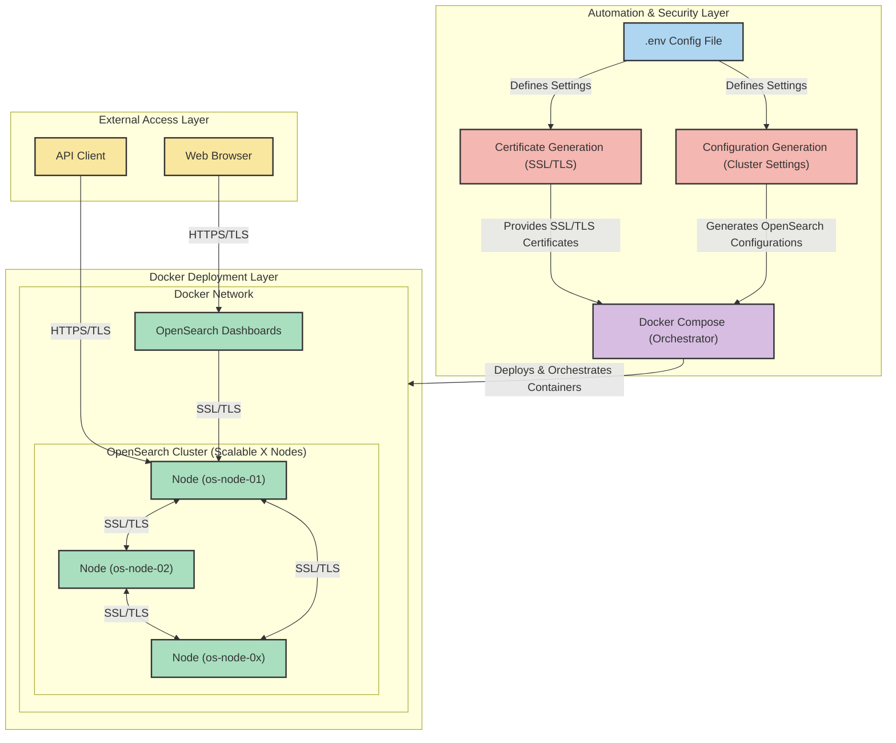

# 🔐 Deploying a Secured Training OpenSearch Cluster

## 📌 Overview
This guide demonstrates how to deploy OpenSearch securely using Docker Compose, with a focus on TLS encryption between nodes and clients. It provides practical steps for launching an encrypted OpenSearch cluster.

Even if you're new to OpenSearch or security best practices, this guide will help you understand the **why and how** behind securing your deployment.

## 🚀 What This Demo Provides
- **Automated Deployment**: Easily spin up an OpenSearch cluster with Docker Compose.
- **SSL/TLS Encryption**: Secure all data transfers between nodes and clients.
- **Scalability**: Add more nodes as needed with minimal configuration.
- **Secure OpenSearch Dashboards**: Access the interface over HTTPS.

## 🏗 Architecture
This project is designed for ease of use and scalability. Below is a high-level view of the setup:



## 🔑 Understanding the TLS Certificates
In this setup, TLS certificates are generated to ensure **confidentiality, integrity, and authentication** of communications between different components. Below are the key reasons for generating various certificates:

### **1️⃣ Root CA Certificate (`root-ca.pem`)**
- Acts as the **trust anchor** for the OpenSearch cluster.
- Self-signed and used to sign all other certificates.
- Helps establish a **chain of trust** within the cluster.

### **2️⃣ Admin Certificate (`admin.pem`)**
- Used to authenticate the **administrator user** who manages security settings.
- Required for operations like **index creation, user roles, and permissions management**.

### **3️⃣ OpenSearch Node Certificates (`os-node-XX.pem`)**
- Each OpenSearch node receives a **unique certificate**.
- Ensures **mutual authentication** between nodes in the cluster.
- Encrypts internal **node-to-node communication** to prevent **man-in-the-middle attacks**.

### **4️⃣ OpenSearch Dashboards Certificate (`os-dashboards.pem`)**
- Used to secure the **OpenSearch Dashboards UI** over HTTPS.
- Prevents unauthorized users from intercepting credentials or query data.
- Ensures a **trusted connection** between users and Dashboards.

### **5️⃣ Certificate Private Keys (`*-key.pem`)**
- Each certificate comes with a **private key** that should never be shared.
- Used to decrypt data and establish **authenticated, encrypted sessions**.

## 🛠 Getting Started
This deployment is fully automated. Just run:

```bash
git clone https://github.com/mocharifi/opensearch-training.git
cd opensearch_secure_deployment
./scripts/setup.sh
```

Once running, access:
- **OpenSearch API**: [`https://localhost:9200`](https://localhost:9200)
- **Dashboards UI**: [`https://localhost:5601`](https://localhost:5601)

Once the cluster is deployed, you can test connectivity using the admin certificate to ensure secure access:
```bash
curl --cert deploy/certificates/admin.pem --key deploy/certificates/admin-key.pem --cacert deploy/certificates/root-ca.pem  "https://localhost:9201/_cluster/health?pretty"
```
